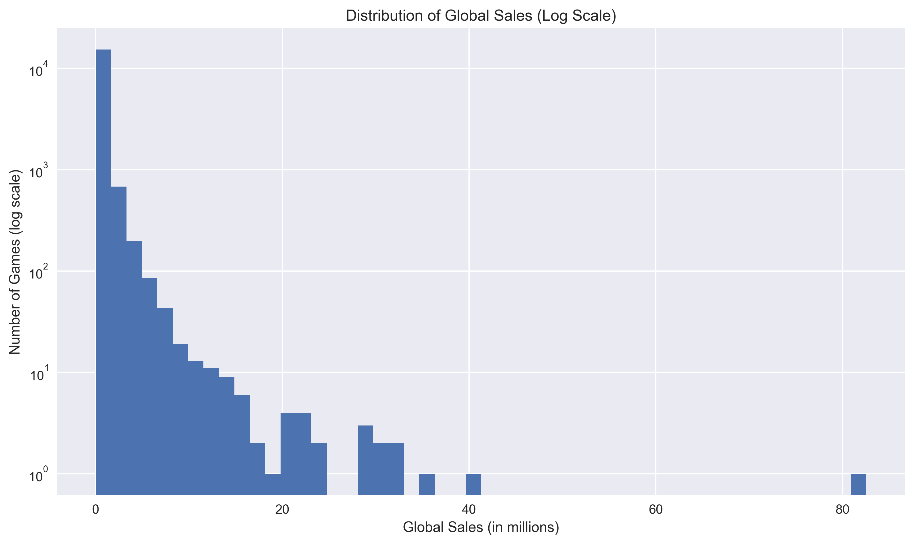
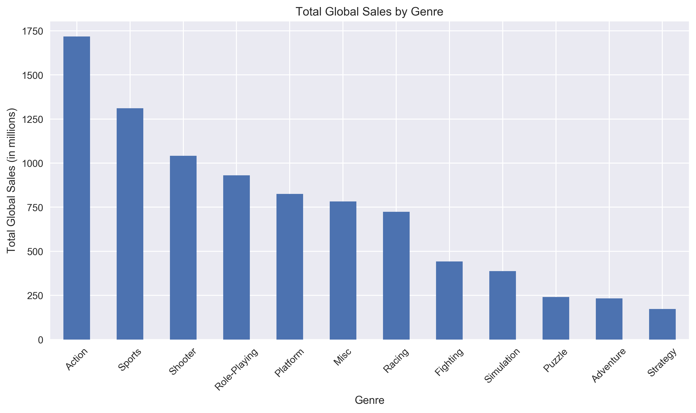
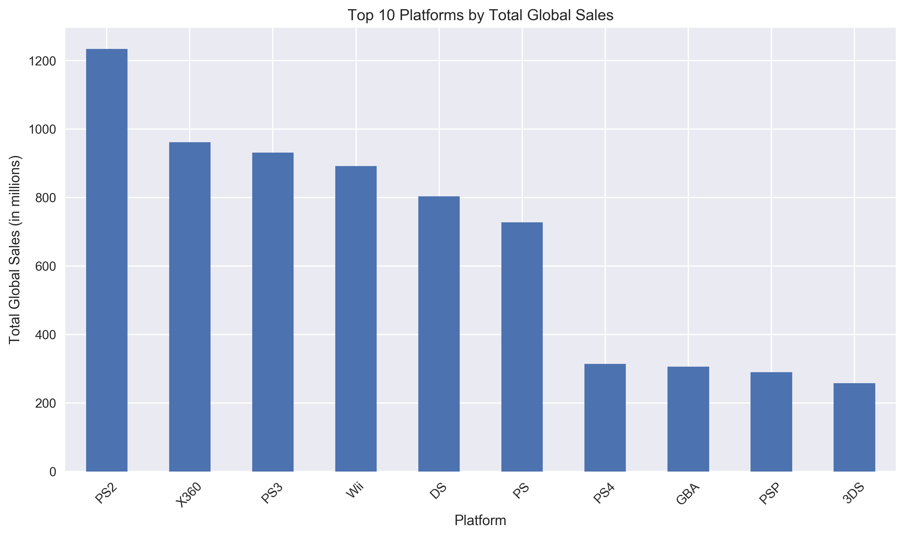

# What Makes a Video Game Successful?
## An Analysis of Genre, Platform, Ratings, and Sales

## Overview
This project explores historical video game data to analyze how genre, platform, critic scores, user scores, and sales relate to commercial success.

The goal is to identify patterns that help explain which games and categories perform best, and which factors are most associated with higher sales.

## Full Notebook
See the complete analysis here: [video_game_success_analysis.ipynb](notebooks/video_game_success_analysis.ipynb)

## Dataset
The analysis uses the Kaggle dataset **Video Game Sales with Ratings**.

Dataset link: [Video Game Sales with Ratings on Kaggle](https://www.kaggle.com/datasets/rush4ratio/video-game-sales-with-ratings/data)

The raw dataset is **not included** in this repository. To run the notebook locally, download the dataset from the Kaggle page and place the CSV file inside the `data/` folder with the name:

`video_game_sales_ratings.csv`
## Tools Used
- Python
- pandas
- NumPy
- Matplotlib
- Seaborn
- Jupyter Notebook

## Project Structure
```text
video-game-success-analysis/
├── README.md
├── requirements.txt
├── .gitignore
├── data/
│   └── README.md
├── images/
│   └── saved analysis charts
└── notebooks/
    └── video_game_success_analysis.ipynb
```

## Main Questions
- Which genres generate the highest total and average sales?
- Which platforms and publishers dominate total global sales?
- Do critic scores and user scores relate to commercial success?
- How has the number of game releases changed over time?

## Key Findings
- Global sales are highly skewed: most games sell relatively little, while a small number of blockbuster titles account for very high sales.
- Action games generate the highest **total** sales, while Platform and Shooter games perform better in terms of **average** sales per game.
- Critic scores show a **moderate positive** relationship with global sales (**Spearman ≈ 0.39**).
- User scores show a **weak positive** relationship with global sales (**Spearman ≈ 0.15**).
- Game releases increased strongly from the mid-1990s, peaked around 2008–2009, and then declined in the dataset.
- Nintendo has the highest total global sales among publishers in this dataset.

## Sample Visualizations

### Distribution of Global Sales (Log Scale)


### Total Global Sales by Genre


### Top 10 Platforms by Total Global Sales


## Limitations
This dataset is historical and appears incomplete for years after 2016, so the findings should be interpreted as patterns within this dataset rather than a complete representation of the current video game industry.

## How to Run
1. Clone or download this repository.
2. Download the dataset from Kaggle.
3. Place the CSV file in the `data/` folder and rename it to `video_game_sales_ratings.csv`.
4. Open `notebooks/video_game_success_analysis.ipynb`.
5. Run the notebook cells in order.

## Repository Contents
- `notebooks/video_game_success_analysis.ipynb` — main analysis notebook
- `data/README.md` — instructions for local dataset setup
- `requirements.txt` — project dependencies
